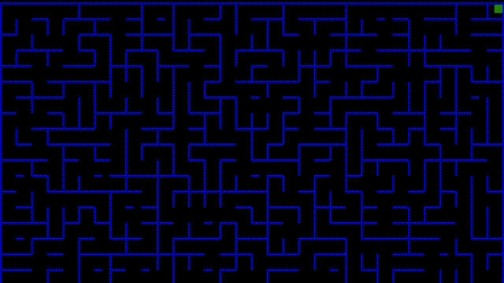

# CubeLab3D

This project is written with a [libGDX](https://libgdx.com/).

The application generates difficult to navigate mazes.
____

### Preview:

____

### 3D Game update!

#### Explore the generated maze.

Special thanks to [PilzHere](https://github.com/PilzHere) for the project [Foxenstein3D](https://github.com/PilzHere/Foxenstein3D) from which I took most of the code.
