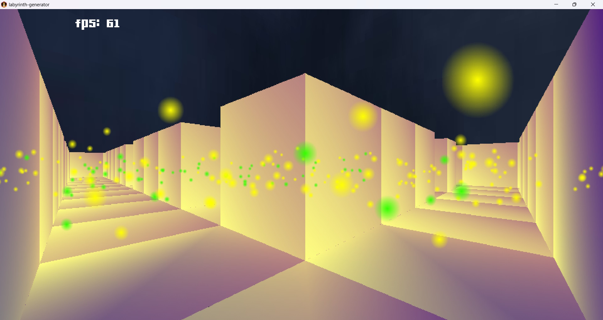

# CubeLab3D

This app is written just for fun with a [libGDX](https://libgdx.com/).

The application generates difficult to navigate mazes.
____

### Preview:

____

### 3D Game update!

#### Explore the generated maze.

Thanks to [PilzHere](https://github.com/PilzHere) for the project 
[Foxenstein3D](https://github.com/PilzHere/Foxenstein3D) from which I took most of the code.

#### Contains:

Chunks, frustum cull, overlap filters, multithreading and transactions!
